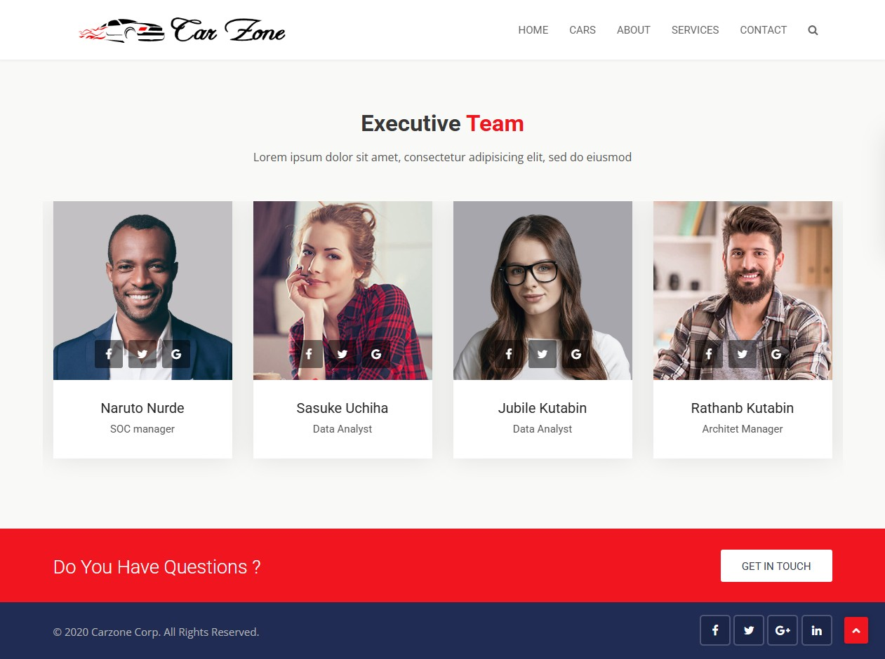
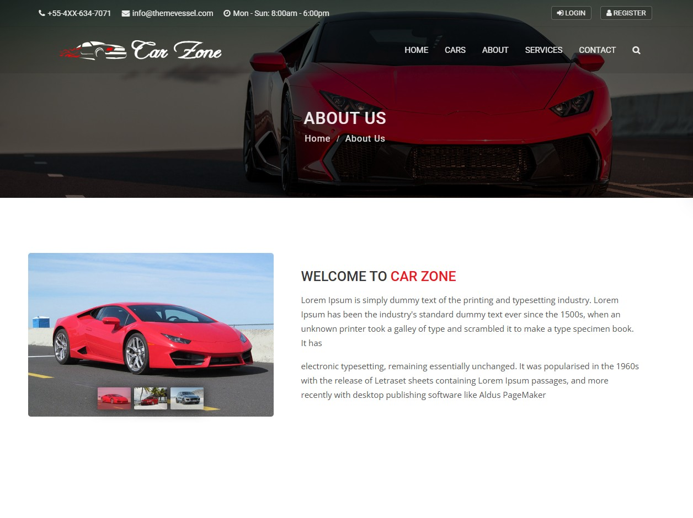
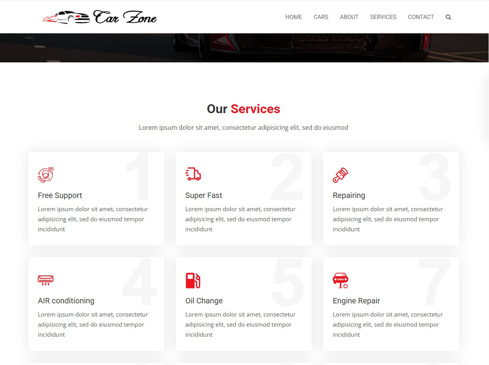
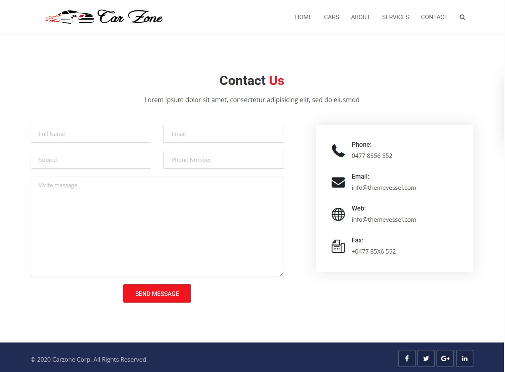
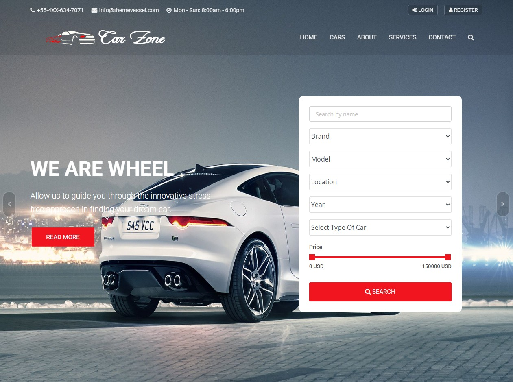
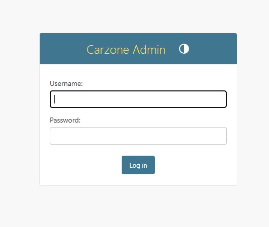
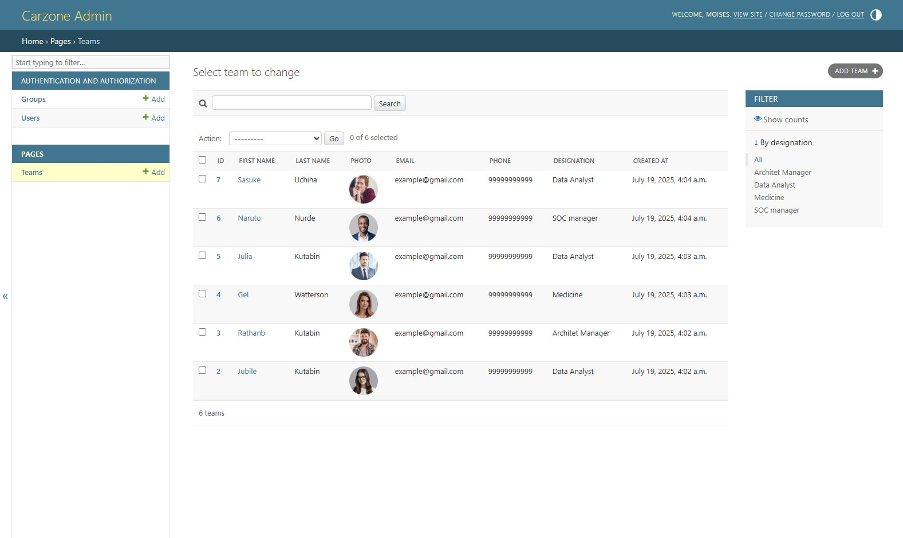

# 🚗 Carstore Project | Projeto Carstore

[](LICENSE)  
[](https://github.com/LinuxEater/Carstore-Project)  
[](https://github.com/LinuxEater/Carstore-Project)

---

## 📋 Overview | Visão Geral

**EN:** Carstore is a modern, responsive web application that showcases vehicle inventory and facilitates contact through a sleek frontend interface. Built with HTML, CSS, JavaScript, and an admin panel for backend management.

**PT-BR:** Carstore é uma aplicação web moderna e responsiva que exibe o estoque de veículos e facilita o contato com uma interface elegante. Desenvolvida com HTML, CSS, JavaScript e um painel administrativo para gerenciamento.

---

## 🖼️ Screenshots

### 🔹 Homepage


### 🔹 About Page


### 🔹 Services Page


### 🔹 Contact Us


### 🔹 Carzone Home


### 🔹 Admin Panel (Main)


### 🔹 Admin Panel (Alternate)


---

## ⚙️ Project Structure | Estrutura do Projeto

```
/
├── screenshots/
│   ├── aboutpage.jpg
│   ├── homepage2.jpg
│   ├── servicespage.jpg
│   ├── contactuspage.jpg
│   ├── carzone_home.jpg
│   ├── adminpanel2carzone.jpg
│   ├── asminpanelcarzone.jpg
├── index.html
├── about.html
├── services.html
├── contact.html
├── app.js
└── README.md
```

---

## 🧩 Features | Funcionalidades

- EN: Clean and accessible pages: Home, About, Services, Contact  
- PT: Páginas limpas e acessíveis: Início, Sobre, Serviços, Contato

- EN: Responsive layout for all devices  
- PT: Layout responsivo para todos os dispositivos

- EN: Integrated social links and logo rendering via app.js  
- PT: Links sociais integrados e exibição do logotipo via app.js

- EN: Admin panel and Carzone management interface  
- PT: Painel administrativo e interface de gestão Carzone

---

## 🚀 How to Run | Como Executar

1. **EN:** Clone the repository:  
   **PT:** Clone o repositório:  
   ```bash
   git clone https://github.com/LinuxEater/Carstore-Project.git
   ```
2. **EN:** Open `index.html` in your browser  
   **PT:** Abra `index.html` no seu navegador

3. **Optional:** Use a local server (`live-server`, `http-server`, etc.)  
   **Opcional:** Use um servidor local (`live-server`, `http-server`, etc.)

---

## 🧑‍💻 Contributing | Contribuindo

**EN:** Contributions are welcome!  
**PT:** Contribuições são bem-vindas!  

Steps | Etapas:
- Fork the repo | Faça um fork do repositório  
- Create a new branch | Crie uma nova branch (`feature/...` ou `fix/...`)  
- Commit using Conventional Commits | Faça commits seguindo a convenção  
- Open a pull request | Abra um pull request  

---

## 📄 License | Licença

**EN:** This project is licensed under the MIT License.  
**PT:** Este projeto está licenciado sob a Licença MIT.  

See the [LICENSE](LICENSE) file for more info. | Veja o arquivo [LICENSE](LICENSE) para mais informações.

---

## 📬 Contact | Contato

**EN:** For suggestions or feedback, open an issue on GitHub.  
**PT:** Para sugestões ou feedbacks, abra uma issue no GitHub.